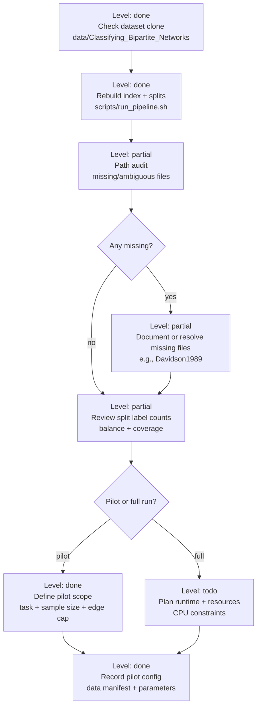

# Data Readiness Flow


```mermaid
flowchart TD
    A[Level: done<br/>Check dataset clone<br/>data/Classifying_Bipartite_Networks] --> B[Level: done<br/>Rebuild index + splits<br/>scripts/run_pipeline.sh]
    B --> C[Level: partial<br/>Path audit<br/>missing/ambiguous files]
    C --> D{Any missing?}
    D -->|yes| E[Level: partial<br/>Document or resolve missing files<br/>e.g., Davidson1989]
    D -->|no| F[Level: partial<br/>Review split label counts<br/>balance + coverage]
    E --> F
    F --> G{Pilot or full run?}
    G -->|pilot| H[Level: done<br/>Define pilot scope<br/>task + sample size + edge cap]
    G -->|full| I[Level: todo<br/>Plan runtime + resources<br/>CPU constraints]
    H --> J[Level: done<br/>Record pilot config<br/>data manifest + parameters]
    I --> J
```
```
